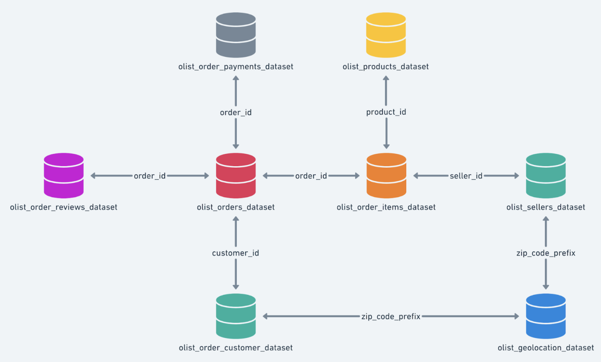
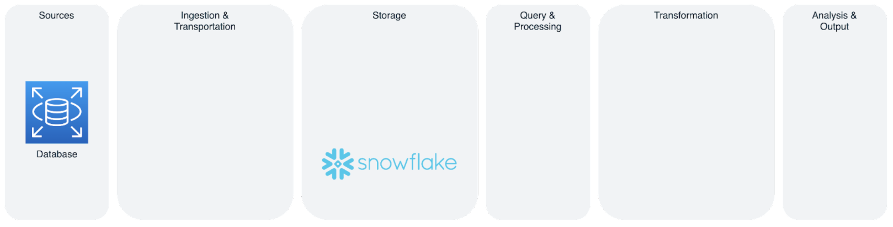

# Snowflake Hands On c2g3

## Learning Objectives

- Implement a data pipeline to load data into Snowflake
- Carry out data transformations in Snowflake
- Explain the Modern Data Infrastructure architecture based on experience

## Case Study

[Olist](https://olist.com/pt-br/) is an e-commerce Brazilian start-up that owns a marketplace where merchants can sell their products through Olist Store and ship them directly to the customers using Olist logistics partners. You will be working with the [Brazilian E-Commerce Public Dataset by Olist](https://www.kaggle.com/datasets/olistbr/brazilian-ecommerce).

## Problem Definition

**Olist** want to analyze the data by answering business questions for the Sales department such as:

- How are the total sales going per month?
- How are the total sales going comparing the current month with the same month for the former year?
- What are the best-selling products for different price ranges historically?
- What are the best-selling product categories per month?

## Work Plan

## References

[Configuring a Snowflake Storage Integration to Access Amazon S3](https://docs.snowflake.com/en/user-guide/data-load-s3-config-storage-integration.html)
